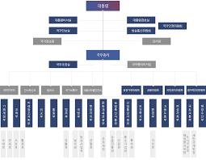
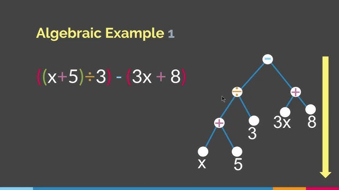

# 트리
> https://www.youtube.com/watch?v=SSLNiP438OA&list=PL0E_1UqNACXD3NsHhF3qUjts4Lkn6KBXR&index=7&pp=iAQB

## 특징

- 선형 구조가 아닌 비선형 구조
- 선형 구조에 비해 훨씬 더 효율적이고 유용하다
- 조직도/계보표가 대표적인 트리 구조이다
  
- root가 존재한다(부모가 없는 최상위 노드)
- subtree가 존재한다
- 순서는 존재하지 않으며, left right.. 이 존재한다

## 주요 용어 Teminology
- Node (vertex): 트리 구조에서 하나의 원소를 나타냄  
- Edge: 노드 간의 연결을 나타내는 선  
- Parent: 현재 노드를 직접 연결하여 포함하는 상위 노드  
- Child: 특정 부모 노드에 연결된 하위 노드  
- Siblings: 같은 부모를 공유하는 노드들  
- Root: 트리의 최상단에 있는 노드 (부모가 없음)  
- Leaf: 자식 노드가 없는 노드 (말단 노드)  
- Ancestor: 현재 노드로부터 위쪽에 위치한 모든 상위 노드들  
- Descendant: 현재 노드로부터 아래에 위치한 모든 하위 노드들  
- Subtree: 트리의 일부로, 특정 노드를 루트로 하는 트리 구조

## 이진 트리
- 비어있거나
- root라는 single node가 존재하며, 2개의 노드가 붙어있는 것을 이진트리라고 부른다 
- algebraic expression을 이진트리로 표현 가능하다
  
- array로도 구현가능하다(매우 비효율적)
- 일반적으로 객체/구조체의 참조로 표현한다
```python
class TreeNode():
    def __init__(self, x):
        self.item = x
        self.left = none
        self.right = none
```

```python
class BinaryTree():
    def __init__(self, node):
        self.root = node
```

- 이진 트리는 구조상 재귀적인 형태를 띠므로, 대부분의 연산은 재귀적으로 구현하기에 적합하다.
    - 탐색/삽입/삭제/순회(order)

## 이진 탐색
- 정렬된 배열 또는 이진 탐색 트리에서 사용되는 탐색 알고리즘이다  
- 배열의 가운데 값을 기준으로 탐색 범위를 절반으로 줄여가며 탐색한다  
- 시간복잡도는 O(log n)이다 (이진 탐색 트리의 경우, 균형 잡혀 있을 때)  
- 이진 탐색을 위해서는 데이터가 반드시 정렬되어 있어야 한다  
- 이진 탐색은 반복문 또는 재귀로 구현할 수 있다  

```python
sorted(arr)

def binary_search(arr, target):
    left, right = 0, len(arr) - 1
    while left <= right:
        mid = (left + right) // 2
        if arr[mid] == target:
            return mid
        elif arr[mid] < target:
            left = mid + 1
        else:
            right = mid - 1
    return -1
```

- 이진 탐색 문제 예시(백준 gold2 1578)
```java
public class Main {
    /* https://www.acmicpc.net/problem/1578
    세계 정복
    시간 제한	메모리 제한
        2 초	128 MB
    문제
    오세준은 세계 정복을 위해 전 세계에 있는 N개의 국가를 정복했다.
    세준이는 N개의 국가에 있는 사람들이 서로 친하지 않음을 깨닫고 세계 정복을 위해서라면 모든 사람들을 서로 친하게 만들어야 한다는 것을 알았다.

    세준이는 전세계의 사람들을 그룹으로 나누려고 한다.
    그룹을 나누는 방법에는 다음과 같은 조건이 있는데, 첫 번째는 그룹에 들어있는 사람의 수는 정확히 K명이어야 한다.
    또, 각 그룹에 있는 사람들은 모두 다른 나라 소속이어야 한다는 것이다.
    세준이는 N개의 국가에 살고 있는 사람의 수가 주어졌을 때, 이 사람들을 최대 몇 개의 그룹으로 나눌 수 있는지 궁금해졌다.
    예를 들어, 중국에 살고 있는 사람이 4명, 캐나다에 살고 있는 사람이 4명, 폴란드, 스웨덴, 미국에 살고 있는 사람이 모두 4명이고,
    K가 4라면, 세준이는 최대 5개의 그룹으로 나눌 수 있다.

    캐나다, 중국, 폴란드, 스웨덴
    캐나다, 중국, 폴란드, 미국
    캐나다, 중국, 스웨덴, 미국
    캐나다, 폴란드, 스웨덴, 미국
    중국, 폴란드, 스웨덴, 미국
    만약 어느 그룹에도 들어가지 않는 사람이 있다면, 세준이는 이 사람들을 과감히 무시한다.

    입력
    첫째 줄에 국가의 수 N과 K가 주어진다. N은 K보다 크거나 같고, 50보다 작거나 같은 자연수이고, K는 20보다 작거나 같은 자연수이다.
    둘째 줄에는 각 나라에 살고 있는 사람의 수가 공백으로 구분해서 차례대로 주어진다. 이 수는 1000000000보다 작거나 같은 자연수이다.

    출력
    첫째 줄에 정답을 출력한다. 정답은 2^63-1보다 작거나 같다.
    */

    public static void main(String[] args) throws IOException {
        System.setIn(new FileInputStream("src/main/java/baekjoon/gold/_1578/input"));
        BufferedReader br = new BufferedReader(new InputStreamReader(System.in));
        StringTokenizer st1 = new StringTokenizer(br.readLine());
        int N = Integer.parseInt(st1.nextToken());
        int K = Integer.parseInt(st1.nextToken());

        StringTokenizer st2 = new StringTokenizer(br.readLine());
        List<Integer> countryList = new ArrayList<>();
        for (int i = 0; i < N; i++) {
            int countryNum = Integer.parseInt(st2.nextToken());
            countryList.add(countryNum);
        }

        Collections.sort(countryList);

        // 인구수가 최대 10억, log N 혹은 그 이하의 알고리즘 필요
        // 이진 탐색으로 말이 되는 최대 그룹을 찾는다
        long answer = binarySearch(countryList, K);

        System.out.println(answer);
    }

    static long binarySearch(List<Integer> countryList, int K){

        long left = 1;
        long right = 50000000001L;
        long answer = 0;

        while (left <= right){
            // mid 값은 그룹당 필요한 사람의 숫자
            long mid = (left + right) / 2;

            boolean result = canGroup(countryList, K, mid);
            // 최대값 탐색
            if(result) {
                left = mid + 1;
                // 맞는 위치로 갱신시킨다
                answer = mid;
            } else {
                right = mid - 1;
            }
        }

        return answer;
    }

    static boolean canGroup(List<Integer> countryList, int K, long mid) {
        long peopleCount = 0;
        
        // 각 그룹에서 가능한 숫자를 모두 모은다
        for (Integer i : countryList) {
            long min = Math.min(mid, i);
            peopleCount += min;
        }
        
        // 필요한 사람보다 많은지 판정한다
        if((long) mid *K <= peopleCount){
            return true;
        } else {
            return false;
        }
    }
}
```

### 균형 트리

#### RB Tree (Red-Black Tree)
- 이진 탐색 트리의 일종으로, 스스로 균형을 유지하는 구조이다  
- 모든 노드는 red 또는 black 중 하나의 색을 가진다  
- 다음과 같은 성질을 반드시 만족한다
  - 루트 노드는 항상 black이다  
  - 모든 리프(NIL 노드)는 black이다  
  - red 노드의 자식은 반드시 black이다 (즉, red 노드는 연속될 수 없다)  
  - 어떤 노드에서 리프 노드까지 가는 모든 경로에는 같은 수의 black 노드가 존재한다 (black height)  
- 삽입이나 삭제 시 위 조건을 위반하면 회전(rotations)과 색 변경(recoloring)을 통해 트리 균형을 맞춘다  
- 삽입 시간, 삭제 시간, 탐색 시간 모두 O(log n)을 보장한다  
- AVL 트리보다 다소 느슨한 균형 조건을 가지므로, 삽입·삭제 시 리밸런싱이 더 적다  
- Java의 TreeMap, C++의 map/set 등에서 내부적으로 사용된다  

#### AVL Tree (Adelson-Velsky and Landis Tree)
- 최초로 고안된 자기 균형 이진 탐색 트리다  
- 모든 노드는 왼쪽 서브트리와 오른쪽 서브트리의 높이 차가 1 이하임을 보장한다  
- 이 높이 차이를 균형 인수(balance factor)라 하며, 각 노드의 balance factor는 -1, 0, 1 중 하나여야 한다  
- 탐색, 삽입, 삭제 모두 O(log n)의 시간복잡도를 가진다  
- 삽입이나 삭제로 인해 균형이 깨지면 회전(rotations)을 통해 트리를 다시 균형 잡는다  
  - 회전의 종류:
    - LL 회전 (단일 우회전)
    - RR 회전 (단일 좌회전)
    - LR 회전 (좌-우 이중회전)
    - RL 회전 (우-좌 이중회전)
- AVL 트리는 Red-Black Tree보다 더 엄격한 균형 조건을 유지한다  
  - 탐색 속도는 더 빠르지만, 삽입/삭제 시 리밸런싱이 더 자주 발생한다  
- 실시간 검색이나 잦은 조회가 요구되는 시스템에 적합하다