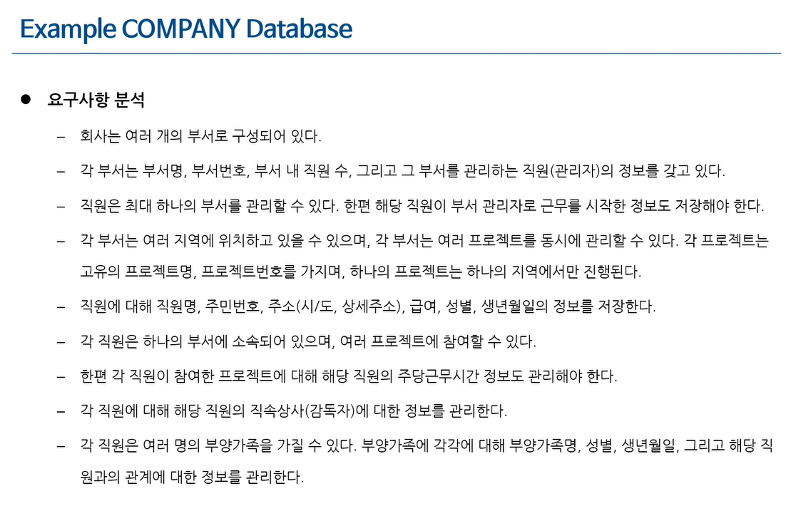

# 개념적 모델링 (Conceptual Data Modeling)

- 업무 기술서의 내용을 개념적으로 표현하는 것(도식화)
  - 가장 많이 사용하는 것: Entity-Relationship Model(개체 관계 모델)
  - 이 모델을 다이어 그램으로 그린 것이 ERD(Entity Relationship Diagram)

## ER Model Concepts

> ER Model은 개체, 관계, 속성으로 구성되어 있다

- 개체(Entity)
  - 실세계에 존재하는 의미있는 하나의 정보 단위
  - 물리적 객체(학생, 자동차, 강의실..) 뿐 아니라 개념적 객체(프로젝트, 직업, 교과목..)도 포함
- 관계(Relation)
  - 개체들 사이의 연관성
    - `학생`과 `교과목` 사이의 `수강`관계
- 개체와 관계는 정말 구분하기 힘들다(ex. 결혼-진행-예식장/ 남자-결혼-여자, 이 경우 두가지 모두 가능하다)
- 속성(Attribute)
  - 개체 또는 관계가 가지는 본질적 성질
  - 학생의 속성(학번, 혈액형)
  - 결국 인스턴스(튜플의 집합)은 속성의 집합이다
  - 학생의 속성(성별, 나이)
  - 교과목의 속성(과목명, 학점)
  - 수강의 속성(평점, 이수구분[학생에 따라서 구분이 다를 수 있기에, 수강이 된다]): 어떤 학생이 어떤 교과목을 수강한 EVENT를 모델링하는 것

### Types of attributes

- Single-valued vs Multi-valued
  - Single-valued(항상 하나의 값만을 가지는 것, 나이)
    - signle-valued가 많다
  - Multi-valued(여러 값을 가질 수 있는 것, 취미)
- Simple vs Composite
  - Simple Attribute: 더 이상 쪼개지지 않는 원자값을 갖는 속성(나이, 학번..)
  - Composite Attribute: 몇 개의 요소로 분해될 수 있는 속성(주소- 시, 군, 구, 번지..)
    - Composite를 쪼갠것이 simple attribute가 된다
    - 예를 들어 이름도 홍/길동으로 쪼갤 수 있다
    - 모든 개체는 규칙을 정하기 나름이다
    - 트리 구조 처럼 뻗어나간다
- Stored vs Derived
  - stored는 저장된 속성, derived는 저장된 것을 이용해 계산이 가능한 속성을 의밓나다
  - 저장된 다른 데이터로부터 유도 가능한 속성
    - 각 과목의 성적 -> 총점
    - 주민등록번호 -> 나이
  - 디스크의 값을 더 소모하는게 낫다고 판단할 경우(계산에 많은 자원이 필요하다면) 나이, 총점 같은 derived 속성도 설계자의 판단하게 stored 속성이 될 수 있다
  - 실무에서는 유도 가능한 속성이더라도 자원 소모를 아끼기 위해 stored로 표현하는 경우가 많다
  - 학술적으로는 derived로 표현한다
- 대부분의 속성은 signled-valued, simple, stored 속성이다

### Entity Types and Key Attributes

> 키 속성은 반드시 유일성과 최소성을 만족해야 한다

- 키 속성(Key Attributes)
  - 어떤 개체에 대해서 항상 유일한 값을 갖는 속성(또는 속성들의 집합)
    - 유니크 속성을 의미한다(유일성)
    - 학생의 학번, 책의 ISBN, 자동차의 차량번호(속성)
    - 축구선수의 key attributes는 팀명 + 등번호가 된다(집합)
  - 특정 snapshot(테이블의 전체 튜플)이 아닌, 해당 개체의 모든 가능한 snapshot의 집합을 고려하여 파악되어야 한다
    - 예를들면 이름은 튜플의 갯수가 적다면 유일할 수 있지만, 튜플의 갯수가 많아진다면 유일하지 않을 확률이 높다

#### 복합 키(Composite key)

- Composite attirubte가 키 속성이 되는 경우
- 복합 키는 최소성을 가져야 한다
  - (팀명, 등번호) O vs (팀명, 등번호, 선수명) X
- 각 개체는 하나 이상의 키를 가질 수 있다
  - 학생: 주민등록, 학번 모두가 가능하다
- 어떤 개체는 키를 갖지 않을 수 있다
  - 약성 개체(Weak Entity)

### Identifier

- Conceptual design에서는 Identifier가 존재한다
  - logical design에서는 Identifier가 primary key라고 불린다
    - Primary키는 반드시 한개가 있어야 한다(0, 다수 불가능)
  - logical design의 primary key는 반드시 한개만 있어야 하지만, Identifier의 경우 여러개가 있거나 없어도 된다

## 예제

> 업무 기술서로부터 개념적 모델링을 구축

- 같은 업무 기술서로부터 다른 개념적 모델링이 나올 수 있다
- Entity -> Relation -> Attribute의 순서로 Conceptual Modeling을 진행해야한다(손으로 작업 추천)